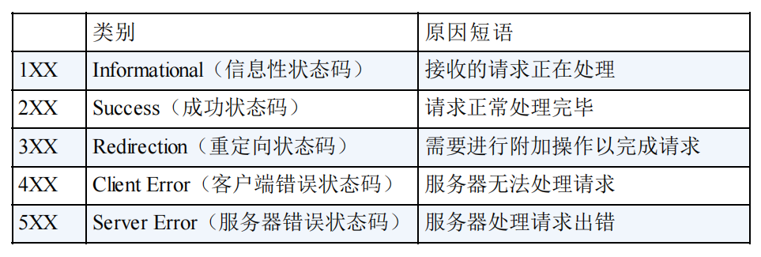

# 网络

## HTTP

### HTTP/1.1的方法

+ GET：获取资源
+ POST：传输实体主体。就是说POST请求是想告诉服务器某条信息，比如增删改，其目的不在获取响应的内容。
+ PUT：传输文件。鉴于 HTTP/1.1 的 PUT 方法自身不带验证机制，任何人都可以 上传文件 , 存在安全性问题，因此一般的 Web 网站不使用该方法。
+ HEAD：只返回响应头，不携带主体。
+ OPTIONS：

### 响应状态码

#### 1XX
+ 101:Switching Protocols，HTTP升级为WebSocket时的响应码就是101。

#### 2XX
2XX 的响应结果表明请求被正常处理了。
+ 200
+ 204：No Content
+ 206：Partial Content。对应请求头Range，响应头Content-Range。

#### 3XX
3XX 响应结果表明浏览器需要执行某些特殊的处理以正确处理请求。
+ 301：Removed Permanently，永久性重定向。该状态码表示请求的资源已被分配了新的 URI，以后应使用资源现在所指的 URI。在请求的URL已被移除时使用，响应的Location首部中应包含资源现在所处的URL。
+ 302：Found，临时性重定向。
+ 304：Not Modified，缓存有效，从缓存读取资源。相关请求头：Last-Modified/If-Modified-Since,Etag/If-None-Match.

#### 4XX
4XX 的响应结果表明客户端是发生错误的原因所在。
+ 400：Bad Request。该状态码表示请求报文中存在语法错误。
+ 401：Unauthorized。需认证。
+ 403：Forbidden。无权限。
+ 404：Not Found。

#### 5XX
5XX 的响应结果表明服务器本身发生错误。
+ 500: Internal Server Error
+ 503：Service Unavailable。该状态码表明服务器暂时处于超负载或正在进行停机维护，现在无法处理请求。

### HTTP首部

+ 端到端首部：经过代理或缓存服务器后仍需要携带到最终目标服务器的首部字段。
+ 逐跳首部：经过代理或缓存后不需要继续携带的首部字段。分在此类别中的首部只对单次转发有效，会因通过缓存或代理而不再转发。HTTP/1.1 和之后版本中，如果要使用 hop-by-hop 首部，需提 供 Connection 首部字段。
>八个逐跳首部：Connection、Keep-Alive、Proxy-Authenticate、Proxy-Authorization、Trailer、TE、Transfer-Encoding、Upgrade。其余首部皆为端到端首部。

Connection 首部字段具备如下两个作用：
1. 控制不再转发给代理的首部字段
2. 管理持久连接：HTTP/1.1 版本的默认连接都是持久连接(Connection: Keep-Alive)。为此，客户端会在持 久连接上连续发送请求。当服务器端想明确断开连接时，则指定 Connection 首部字段的值为 Close。

### HTTPS
>HTTP+ 加密 + 认证 + 完整性保护 =HTTPS。HTTPS 是身披 SSL 外壳的 HTTP。
通常，HTTP 直接和 TCP 通信。当使用 SSL时，则演变成先和 SSL通 信，再由 SSL和 TCP 通信了。简言之，所谓 HTTPS，其实就是身披 SSL协议这层外壳的 HTTP。
